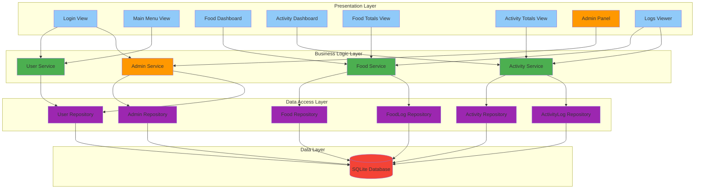
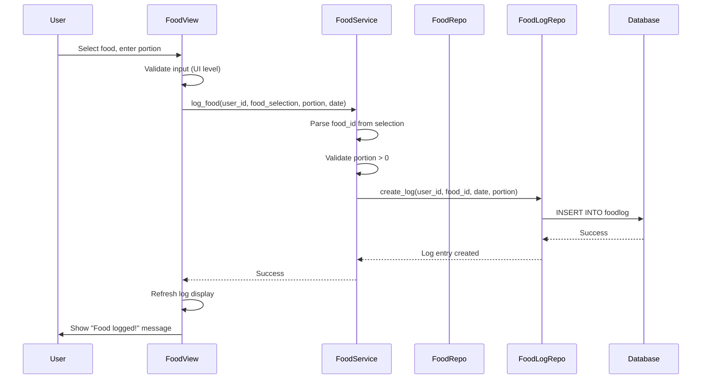
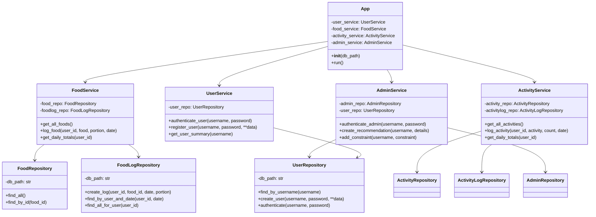

# Laihdutanyt Application - Technical Architecture

##  Architecture Overview

The Laihdutanyt application follows a **layered architecture** pattern with clear separation of concerns:

```
┌─────────────────────────────────────────────────┐
│         Presentation Layer (UI)                 │
│  - Login/Register Views                         │
│  - Dashboard Views (Food, Activity, Totals)     │
│  - Admin Panel Views                            │
│  - UI Components (Frames, Dialogs)              │
└──────────────────┬──────────────────────────────┘
                   │
┌──────────────────▼──────────────────────────────┐
│         Business Logic Layer (Services)         │
│  - UserService                                  │
│  - FoodService                                  │
│  - ActivityService                              │
│  - AdminService                                 │
└──────────────────┬──────────────────────────────┘
                   │
┌──────────────────▼──────────────────────────────┐
│         Data Access Layer (Repositories)        │
│  - UserRepository                               │
│  - FoodRepository                               │
│  - ActivityRepository                           │
│  - FoodLogRepository                            │
│  - ActivityLogRepository                        │
│  - AdminRepository                              │
└──────────────────┬──────────────────────────────┘
                   │
┌──────────────────▼──────────────────────────────┐
│         Data Layer (Database)                   │
│  - SQLite Database (laihdutanyt.db)             │
│  - Tables: user, food, activity, foodlog,       │
│    activitylog, admin, recommendation,          │
│    user_constraint                              │
└─────────────────────────────────────────────────┘
```

##  Project Structure

```
ot-harjoitustyo/
├── src/
│   ├── Laihdutanyt_v2.py          # Legacy monolithic file (to be deprecated)
│   ├── main.py                     # NEW: Application entry point
│   │
│   ├── ui/                         # NEW: Presentation layer
│   │   ├── __init__.py
│   │   ├── app.py                 # Main application window & orchestration
│   │   ├── views/                 # Individual view modules
│   │   │   ├── __init__.py
│   │   │   ├── login_view.py     # Login and registration
│   │   │   ├── main_menu_view.py # User dashboard menu
│   │   │   ├── food_view.py      # Food logging dashboard
│   │   │   ├── activity_view.py  # Activity logging dashboard
│   │   │   ├── food_totals_view.py     # Daily food totals
│   │   │   ├── activity_totals_view.py # Daily activity totals
│   │   │   ├── admin_view.py     # Admin panel
│   │   │   └── logs_view.py      # All logs viewer
│   │   └── components/            # Reusable UI components
│   │       ├── __init__.py
│   │       ├── food_log_frame.py # Food logging form
│   │       └── activity_log_frame.py # Activity logging form
│   │
│   ├── services/                   # NEW: Business logic layer
│   │   ├── __init__.py
│   │   ├── user_service.py        # User management logic
│   │   ├── food_service.py        # Food & logging logic
│   │   ├── activity_service.py    # Activity & logging logic
│   │   └── admin_service.py       # Admin operations logic
│   │
│   ├── repositories/               # Data access layer
│   │   ├── models.py              # Data models (User, Food, Activity)
│   │   ├── user_repository.py
│   │   ├── food_repository.py
│   │   ├── foodlog_repository.py
│   │   ├── activity_repository.py
│   │   ├── activitylog_repository.py
│   │   └── admin_repository.py
│   │
│   ├── scripts/                    # Utility scripts
│   │   ├── aggregate_daily_foods_totals.py
│   │   ├── aggregate_daily_activities_totals.py
│   │   ├── import_foods.py
│   │   └── import_activities.py
│   │
│   ├── data/                       # Database files
│   │   ├── laihdutanyt.db
│   │   ├── sample_foods.csv
│   │   └── sample_activities.csv
│   │
│   └── create_db.py               # Database schema creation
│
└── dokumentaatio/                  # Documentation
    ├── architecture.md            # THIS FILE
    ├── architecture_diagram.mmd   # Mermaid diagram
    └── ...
```

##  Layer Responsibilities

### 1. Presentation Layer (UI)

**Purpose**: Handle all user interface concerns - display, user input, visual feedback

**Responsibilities**:
- Render UI elements (windows, forms, tables)
- Capture user input events
- Display data to users
- Navigate between views
- Window management (positioning, sizing, hide/show)

**Key Principles**:
-  NO business logic
-  NO direct database access
-  Calls service layer for data operations
-  Displays data provided by services

**Example**:
```python
# Good: UI calls service
def _on_login(self):
    if self.user_service.authenticate_user(username, password):
        self.show_dashboard()

# Bad: UI contains business logic
def _on_login(self):
    user = self.user_repo.find_by_username(username)
    if user and self._verify_password(password, user.salt):  # Business logic in UI!
        ...
```

### 2. Business Logic Layer (Services)

**Purpose**: Implement business rules, validation, and data transformation

**Responsibilities**:
- Validate user input
- Enforce business rules
- Coordinate between repositories
- Transform data for UI presentation
- Handle complex operations (aggregations, calculations)

**Key Principles**:
-  NO UI code (no tkinter imports)
-  Uses repositories for data access
-  Returns clean data structures (dicts, lists)
-  Raises exceptions for errors

**Example Services**:
- `UserService`: Authentication, registration, user profile management
- `FoodService`: Food logging, daily totals calculation, CRUD operations
- `ActivityService`: Activity logging, calorie burning 
- 'Weight Logging' : Weight evolution tracking
- 'Periodical Diets' : To find out best fit diet mix based on experimenting 
- `AdminService`: Recommendations, constraints, user management

### 3. Data Access Layer (Repositories)

**Purpose**: Abstract database operations and provide clean data access interface

**Responsibilities**:
- Execute SQL queries
- Map database rows to data models
- Handle database connections
- Provide CRUD operations
- Return dataclass instances or dictionaries

**Key Principles**:
-  NO business logic
-  NO UI code
-  One repository per entity
-  Returns data models or dicts

### 4. Data Layer (Database)

**Purpose**: Persist application data

**Database**: SQLite (laihdutanyt.db)

**Tables**:
- `user`: User accounts and profiles
- `admin`: Administrator accounts
- `food`: Food catalog
- `activity`: Activity catalog
- `foodlog`: User food entries
- `activitylog`: User activity entries
- 'weightlog' : User weight tracking entries
- `recommendation`: Admin recommendations
- `user_constraint`: User health constraints

##  Component Diagram (Mermaid)



##  Data Flow Example: User Logs Food



##  Class Diagram (Simplified)



##  Design Patterns Used

### 1. **Layered Architecture**
- Clear separation between UI, business logic, and data access
- Each layer depends only on the layer below it
- Changes in one layer don't affect others

### 2. **Repository Pattern**
- Abstracts data access logic
- Provides collection-like interface for data entities
- Makes it easy to swap database implementation

### 3. **Service Layer Pattern**
- Encapsulates business logic
- Coordinates between multiple repositories
- Provides clean API for UI layer

### 4. **Model-View Pattern** (simplified MVC)
- Models: Dataclasses in `repositories/models.py`
- Views: UI components in `ui/views/`
- Implicit controller: Service layer coordinates operations

### 5. **Dependency Injection**
- Services receive db_path in constructor
- Easy to test with mock databases
- Clear dependencies

##  Benefits of This Architecture

### Maintainability
-  Each module has single responsibility
-  Easy to locate code (login logic → login_view.py)
-  Changes are isolated

### Testability
-  Business logic separated from UI
-  Services can be tested without UI
-  Repositories can use test database

### Scalability
-  Easy to add new features (new service/view)
-  Can replace UI framework (tkinter → Qt/web)
-  Can replace database (SQLite → PostgreSQL)

### Collaboration
-  Multiple developers can work on different layers
-  Clear interfaces between components
-  Less merge conflicts

### Reusability
-  Services can be used by different UIs (desktop, web, mobile)
-  Repositories abstract database details
-  UI components can be reused

##  Migration Plan

### Phase 1: Service Layer (Current)
 Create service classes
 Move business logic from UI to services
 Services use existing repositories

### Phase 2: UI Refactoring (Next)
 Extract views from monolithic file
 Create separate view modules
 Update views to use services

### Phase 3: Component Extraction (Future)
 Extract reusable UI components
 Create component library
 Standardize UI patterns

### Phase 4: Testing (Future)
 Unit tests for services
 Integration tests for repositories
 UI tests for views

##  Coding Guidelines

### Service Layer

#  Good: Clean service method
def log_food(self, user_id: str, food_selection: str, portion_g: float, date_str: str):
    food_id = self._parse_food_id(food_selection)
    self._validate_portion(portion_g)
    return self.foodlog_repo.create_log(user_id, food_id, date_str, portion_g)

#  Bad: Service with UI code
def log_food(self):
    food = self.food_dropdown.get()  # UI dependency!
    messagebox.showinfo("Success", "Logged!")  # UI code!

### UI Layer

#  Good: UI delegates to service
def _on_log_food(self):
    try:
        self.food_service.log_food(self.user_id, selection, portion, date)
        messagebox.showinfo("Success", "Food logged!")
        self.refresh_display()
    except ValueError as e:
        messagebox.showerror("Error", str(e))

#  Bad: UI contains business logic
def _on_log_food(self):
    food_id = self.selection.split("|")[1]  # Business logic!
    if portion <= 0:  # Validation logic!
        return
    # Direct database access!
    conn = sqlite3.connect(self.db_path)
    ...

### Repository Layer

#  Good: Clean data access
def find_by_username(self, username: str) -> Optional[User]:
    with self._conn() as conn:
        cur = conn.cursor()
        cur.execute("SELECT * FROM user WHERE username = ?", (username,))
        row = cur.fetchone()
        return self._row_to_user(row) if row else None

#  Bad: Repository with business logic
def find_and_validate_user(self, username: str, password: str):  # Too much logic!
    user = self.find_by_username(username)
    if user and self._check_password(password):  # Validation logic!
        return user

##  References

- [Martin Fowler - Service Layer](https://martinfowler.com/eaaCatalog/serviceLayer.html)
- [Repository Pattern](https://martinfowler.com/eaaCatalog/repository.html)
- [Layered Architecture](https://en.wikipedia.org/wiki/Multitier_architecture)


**Document Version**: 1.1  
**Last Updated**: December 9, 2025  
**Author**: In co-design with Claude 4.5 AI
